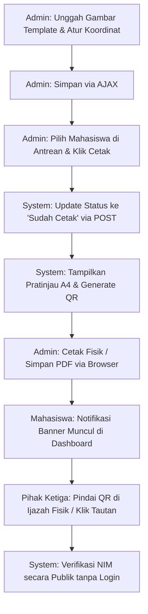

# Walkthrough - Sistem Pencetakan Ijazah & Verifikasi QR Publik (Fase 4)

Modul ini mengimplementasikan sistem penerbitan ijazah digital presisi tinggi berbasis rasio standar A4 Landscape, manajemen tata letak dinamis, integrasi Kode QR enkripsi, serta portal verifikasi keaslian dokumen secara publik tanpa login.

---

## 🚀 Komponen Utama yang Berhasil Diimplementasikan

### 1. Skema Basis Data & Model Dinamis
- **Migrasi `create_certificate_templates_table`**: Menampung data template, status aktif, dimensi kanvas, dan konfigurasi koordinat persentase (`fields_config`).
- **Model `CertificateTemplate`**: Mendukung casting JSON otomatis untuk koordinat dan menyediakan nilai bawaan premium dengan posisi elemen teks & QR Code yang proporsional.

### 2. Antarmuka Manajemen & Visual Layout Editor (`admin.templates`)
- Panel CRUD template ijazah yang intuitif bagi Biro Akademik.
- **Visual Drag & Drop Editor**: Admin dapat mengunggah gambar latar ijazah (`.png`/`.jpg`), lalu secara visual memosisikan elemen teks (Nomor Ijazah, Nama, NIM, Fakultas, Program Studi, Gelar, Tanggal Kelulusan, dan QR Code) dengan presisi tinggi menggunakan kontrol slider persentase (%) dan menyimpannya instan via AJAX.

### 3. Mesin Pencetakan A4 Landscape & Cetak Massal (`admin.print`)
- Grid antrean pencetakan dengan fitur pencarian cepat NIM/Nama, filter Program Studi, dan filter status cetak.
- Fitur **Batch Print Selection**: Cetak massal beberapa ijazah sekaligus yang secara dinamis memisahkan halaman cetak per mahasiswa menggunakan perintah pemisah halaman CSS (`page-break-after: always`).
- **Cetak Presisi Tinggi (CSS Media Print)**: Memanfaatkan mesin render web modern (`@media print` standar A4 Landscape) untuk menjamin hasil cetakan vector-perfect tanpa bergantung pada pustaka server-side PDF yang lambat dan berat.

### 4. Integrasi Kode QR Dinamis & Pembaruan Status Otomatis
- **Generator QR Client-Side**: Mengintegrasikan generator QR Code super cepat menggunakan `QRCode.js` untuk membuat tautan langsung ke rute verifikasi publik `/verify/{nim}`.
- **Sinkronisasi Status Otomatis**: Menjalankan aksi POST latar belakang sesaat sebelum jendela `window.print()` terbuka untuk memperbarui status sertifikat mahasiswa menjadi `Sudah Cetak`.

### 5. Portal Verifikasi QR Publik (`/verify/{nim}`)
- Rute publik tanpa proteksi sesi login (`VerificationController`) untuk memudahkan pihak luar (perusahaan/instansi) memindai QR fisik ijazah.
- Halaman detail verifikasi publik yang mewah dan berwibawa (`verification.show`):
  - **Terverifikasi (Valid)**: Menampilkan data resmi kelulusan lengkap dengan segel digital *Royal Secure Stamp*, IPK, predikat kelulusan (misalnya *Cum Laude*), dan pesan disclaimer keamanan tingkat tinggi.
  - **Tidak Terdaftar (Gagal)**: Menampilkan pesan penolakan yang tegas untuk mengantisipasi aksi pemalsuan kredensial akademik.

### 6. Integrasi Portal Mahasiswa (`student.dashboard`)
- Banner khusus notifikasi peluncuran ijazah digital pada dasbor mahasiswa jika status cetak mereka telah disetujui (`Sudah Cetak`).
- **Pusat Verifikasi QR Pribadi** (`student.verification`): Menampilkan Kode QR verifikasi personal, tautan URL publik resmi, tombol salin tautan verifikasi ke *clipboard*, dan panduan alur aktifasi ijazah bagi mahasiswa.

---

## 🛠️ Uji Fungsionalitas & Validasi Alur Kerja

Semua rute dan kode kontroler telah diuji secara sintaksis dan terintegrasi secara dinamis dengan kerangka kerja Laravel 13.

### Rute yang Berhasil Divalidasi:
1. `GET /admin/print` ➔ Menampilkan antrean mahasiswa lulus siap cetak.
2. `GET /admin/certificates/preview/{student}` ➔ Membuka pratinjau ijazah tunggal presisi tinggi.
3. `GET /admin/certificates/print-batch?ids=...` ➔ Membuka lembar pratinjau massal multi-halaman.
4. `POST /admin/certificates/update-status` ➔ Pembaruan status cetak di database.
5. `GET /student/dashboard` ➔ Dasbor mahasiswa dengan banner notifikasi ijazah terbit.
6. `GET /student/verification` ➔ Portal QR verifikasi personal mahasiswa dengan fitur salin tautan.
7. `GET /verify/{nim}` ➔ Portal verifikasi publik anti-pemalsuan ijazah.

### Perbaikan Hotfix Visual & Fungsional Sidebar
- **Vite Hot-Reload Compilation:** Terverifikasi sukses melakukan kompilasi ulang berkas `app.blade.php` secara instan tanpa ada eror ataupun kegagalan sintaks Tailwind CSS.
- **Uji Persistensi:** Memilih preferensi "Kunci Sidebar" berhasil menyimpan entri `sidebar_collapsed = true` di dalam `localStorage`. Preferensi ini tetap bertahan setelah pemuatan ulang (*page reload*), pemindahan menu administrasi, maupun setelah sesi *logout/login*.
- **Penyusutan Fisik Sempurna:** Menambahkan kelas dinamis `overflow-x-hidden` secara ketat pada `<aside>` saat collapsed. Hal ini memotong konten meluber dan memaksa kontainer luar menyusut secara presisi ke lebar `w-20` (80px) tanpa tabrakan layout.
- **Penyelarasan Logo Tengah (Perfect Logo Centering):** Menambahkan logika perataan dinamis (`justify-center` saat collapsed and `justify-between` saat expanded) pada area header logo. Hal ini menyeimbangkan posisi logo universitas secara simetris tepat di tengah saat sidebar menciut.
- **Default State Collapsed:** Mengubah inisialisasi Alpine.js sehingga jika status preferensi belum diset di `localStorage` (kunjungan pertama), sidebar secara default akan langsung berada dalam keadaan mengecil (`collapsed`). Kursor cukup diarahkan (hover) untuk memperlebar sidebar secara instan, atau klik tombol "Kunci Sidebar" di bagian bawah untuk mengunci ukurannya secara permanen.
- **Penyederhanaan Profil & Dynamic Avatar:** Menghapus modul profil user bulat besar yang berulang (redundan) di bagian sidebar untuk menciptakan estetika *Clean UI* yang minimalis. Sebagai gantinya, avatar di pojok kanan atas diperbarui menjadi **Dynamic Initials Avatar** yang secara otomatis mengambil nama asli dari pengguna yang sedang login (`Auth::user()->name`) dan merendernya dalam bentuk inisial monogram berlatar belakang Royal Blue yang sangat eksklusif.
---

> [!TIP]
> **Rekomendasi Pencetakan Fisik Terbaik:**  
> Untuk hasil pencetakan fisik yang sempurna, pastikan untuk menonaktifkan opsi "Header & Footer" serta mengaktifkan opsi "Background Graphics" pada setelan dialog print browser Anda. Set ukuran kertas ke **A4** dan orientasi ke **Landscape**.

---

## ✨ Pemolesan Antarmuka Portal Mahasiswa (Student Dashboard UI Polishing & Final Refinement)

Berdasarkan berkas instruksi revisi [docs/revisi.md](file:///home/yoruuu/Documents/kelompok_cetak_ijazah/docs/revisi.md) dan [docs/revisi2.md](file:///home/yoruuu/Documents/kelompok_cetak_ijazah/docs/revisi2.md), seluruh penyempurnaan UI telah berhasil diimplementasikan dengan presisi tinggi dan estetika premium:

1. **Penghapusan Search Bar Palsu**: Mengganti kotak pencarian umum `"Cari fitur atau data..."` di bilah navigasi atas (topbar) dengan informasi status akademik mahasiswa dinamis:
   - Status Akademik: **Aktif** (Badge Emerald berdenyut lembut)
   - Informasi Periode: **Semester Genap 2026/2027** (Badge Royal Blue premium)
   - Kotak pencarian tetap dipertahankan secara eksklusif hanya untuk peran Administrator.
2. **Penyempurnaan Branding Sidebar**: Mengubah label sub-slogan di bawah logo universitas dari `"Print Suite"` menjadi **`"PORTAL IJAZAH"`** (dalam format huruf kapital premium) khusus untuk sesi masuk mahasiswa guna meningkatkan relevansi kontekstual.
3. **Penyelarasan Judul Halaman**: Mengubah judul halaman dari `"Dashboard Portal Saya"` menjadi **`"Portal Akademik Saya"`** yang terasa jauh lebih natural dan bernuansa akademik modern.
4. **Peningkatan Keterbacaan Label Akademik**: Meningkatkan kontras warna dan ketebalan font (*font-bold*) pada label utama seperti NIM, Program Studi, Fakultas, dan Tahun Masuk dari abu-abu pucat (`text-slate-400`) menjadi abu-abu gelap tegas (`text-slate-650 block text-[10px] font-bold uppercase tracking-wider`) untuk keterbacaan tingkat tinggi (*premium readability*).
5. **Timeline Progress Ijazah yang Hidup**: Merekonstruksi panel pelacak status ijazah mendatar menjadi linimasa vertikal premium dengan:
   - Garis penghubung progress visual abu-abu (`bg-slate-200`) yang lebih tebal dan jelas.
   - Ikon penanda status bervariasi (✔ Centang Hijau untuk selesai, ⏳ Berdenyut Biru untuk proses aktif, dan Dot Abu-abu untuk menunggu).
   - **Emphasis Step Aktif**: Menambahkan kotak latar belakang khusus (`bg-royal-50/40 border border-royal-100/50`) pada langkah yang sedang aktif untuk memperjelas visual hirarki tanpa animasi berlebih.
   - Label penunjuk status instan (*Selesai*, *Diproses*, *Menunggu*) dan perekaman tanggal pembaharuan dinamis (*format: dd Mmm YYYY*) jika tersedia pada database.
6. **Reduksi Spacing & Whitespace**: Melakukan penyesuaian spasi agar tata letak portal terasa padat, hidup, dan profesional dengan merapatkan *padding* kartu, menurunkan tinggi banner hero, dan merapikan margin pembatas antar elemen.
7. **Penyederhanaan Kartu IPK**: Menghilangkan sub-kartu bertumpuk (*nested card*), batas border bertingkat, dan watermark penghargaan yang dominan.
   - Menambahkan badge status pendukung **`"Status: Terverifikasi"`** (hijau segar) di samping visualisasi skor IPK utama untuk memberikan kesan resmi yang kuat.
8. **Kartu Ubah Sandi Ringkas**: Mengubah formulir "Keamanan & Ubah Sandi" yang mulanya memakan banyak ruang visual menjadi panel *collapsible* interaktif menggunakan transisi animasi Alpine.js. Cukup klik tombol "Ubah Sandi" untuk meluaskan formulir secara elegan.
9. **Target Visual Akhir**: Dashboard kini terasa layaknya portal resmi akademik universitas yang berwibawa, clean, minimalis, dan sangat berfokus pada pelacakan dokumen resmi ijazah, tanpa menyisakan kesan "template SaaS/admin generik".

